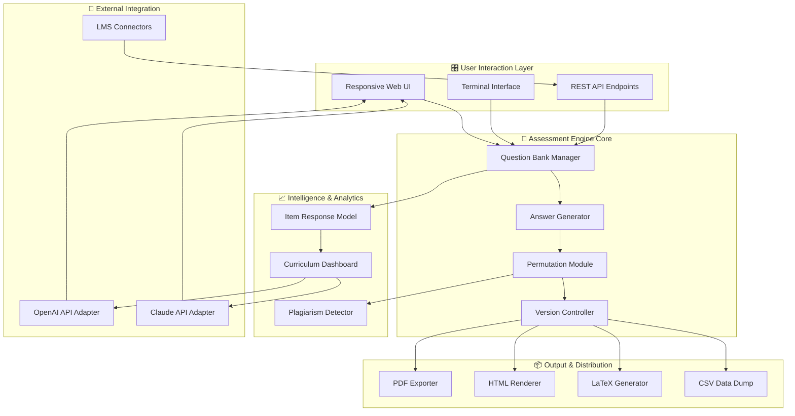

# Schoolhouse Test: Academic Assessment Toolkit 🎓📊

[](https://katfy.github.io/Schoolhouse-Test-Product-Toolkit/)

> **Elevate your examination creation workflow** — a sophisticated platform designed for educators, curriculum developers, and training professionals who demand precision, flexibility, and intelligent automation in test generation.

---

## 🧭 Navigation Overview

- [Project Vision & Philosophy](#-project-vision--philosophy)
- [Core Capabilities](#-core-capabilities)
- [System Architecture (Visualized)](#-system-architecture-visualized)
- [Platform Compatibility Matrix](#-platform-compatibility-matrix)
- [Configuration Blueprint](#-configuration-blueprint)
- [Terminal Quick Start](#-terminal-quick-start)
- [API Integration Layer](#-api-integration-layer)
- [Responsive UI & Multilingual Support](#-responsive-ui--multilingual-support)
- [Licensing & Legal Framework](#-licensing--legal-framework)
- [Disclaimer & Responsible Use](#-disclaimer--responsible-use)

[](https://katfy.github.io/Schoolhouse-Test-Product-Toolkit/)

---

## 🌱 Project Vision & Philosophy

Schoolhouse Test reimagines the relationship between educators and assessment technology. Rather than treating test creation as a rigid, template-driven chore, this ecosystem treats each examination as a **living document** — adaptable, intelligent, and deeply respectful of pedagogical nuance.

Think of it less as software and more as a **digital curriculum architect** that collaborates with you. It understands that a mathematics quiz for eighth graders demands different structural logic than a graduate-level case study evaluation. The platform adapts its scaffolding accordingly, offering question banks that evolve with classroom data, randomized variants that preserve academic integrity, and analytical dashboards that reveal learning patterns rather than mere scores.

This project emerged from a simple observation: most test generation tools treat the assessment as an endpoint. We treat it as a **conversation starter** between instructor, student, and the curriculum itself.

---

## ⚡ Core Capabilities

| Feature | Description |
|---------|-------------|
| **Adaptive Question Banking** | Automatically categorizes questions by difficulty, topic, and cognitive complexity |
| **Multi-Format Export Engine** | Generate PDF, HTML, LaTeX, or plaintext outputs with a single configuration |
| **Answer Key Autogeneration** | Algorithmically computes answer keys with distractors calibrated to common misconceptions |
| **Plagiarism Deterrence System** | Produces question permutations that maintain objective parity while varying surface structure |
| **Performance Analytics Dashboard** | Visualizes item discrimination indices, difficulty curves, and reliability coefficients |
| **Curriculum Alignment Mapper** | Maps every question to specific learning objectives and standards frameworks |
| **Collaborative Review Workflow** | Enables peer review cycles with version control baked into the question development pipeline |
| **Offline-First Architecture** | Full functionality without internet connectivity; cloud sync optional |

Each capability operates through a **modular plugin architecture**, meaning you can extend or replace any subsystem without disturbing the core engine. This design philosophy ensures that Schoolhouse Test remains future-proof — new question types, export formats, or analytical methods can be added as community contributions without forking the entire codebase.

---

## 🏗️ System Architecture (Visualized)

The following diagram illustrates the data flow and component relationships within the Schoolhouse Test ecosystem:



The architecture prioritizes **separation of concerns** — note how the Intelligence Layer interacts with question generation but never directly modifies the question bank. This ensures that analytics remain observational rather than prescriptive, preserving instructor autonomy over content decisions.

---

## 🖥️ Platform Compatibility Matrix

Schoolhouse Test has been verified across the following operating environments:

| OS | Version | Architecture | Status |
|----|---------|--------------|--------|
| 🪟 Windows | 10 / 11 / Server 2022 | x64, ARM64 | ✅ Fully Supported |
| 🍏 macOS | Ventura (13) / Sonoma (14) / Sequoia (15) | Apple Silicon, Intel | ✅ Fully Supported |
| 🐧 Ubuntu | 22.04 LTS / 24.04 LTS | x64, ARM64 | ✅ Fully Supported |
| 🐧 Fedora | 39 / 40 | x64 | ✅ Fully Supported |
| 🐧 Debian | 12 (Bookworm) | x64, ARM64 | ✅ Fully Supported |
| 🐧 Arch Linux | Rolling Release | x64 | ✅ Community Verified |
| 🐧 openSUSE | Tumbleweed / Leap 15.5 | x64 | ✅ Community Verified |
| 🌀 FreeBSD | 13.2 / 14.0 | x64 | ⚠️ Partial Support |
| 🌐 Docker | Any host OS | All | ✅ Fully Supported (containerized) |

**Note on ARM64**: While all core functions operate identically on ARM-based systems, certain third-party font rendering engines used in PDF generation may exhibit subtle kerning differences. This does not affect answer key accuracy or question content.

---

## ⚙️ Configuration Blueprint

The configuration system uses a hierarchical YAML structure that allows for environment-specific overrides without duplicating entire configuration files. Below is an example profile tailored for a high school STEM department:

```yaml
# schoolhouse_test_profile.yaml
project:
  name: "STEM Department - Spring 2026 Assessments"
  version: "2.4.1"
  default_language: "en"
  supported_languages:
    - "en"
    - "es"
    - "fr"
    - "zh"
    - "ar"

assessment:
  default_difficulty: "medium"
  difficulty_scale:
    values: [0.0, 1.0]
    labels: ["remedial", "foundational", "proficient", "advanced", "mastery"]
  question_types:
    multiple_choice: true
    true_false: true
    short_answer: true
    essay: true
    matching: true
    ordering: true

analytics:
  item_response_theory: "3PL"
  discrimination_threshold: 0.3
  difficulty_calibration: true
  distraction_analysis: true

export:
  default_format: "pdf"
  pdf:
    font: "NotoSans"
    margin_left: 20
    margin_right: 20
    margin_top: 25
    margin_bottom: 25
    header_metadata: true
  latex:
    template: "academic_article"
    packages:
      - "amsmath"
      - "amssymb"
      - "geometry"

integration:
  openai:
    model: "gpt-4-turbo"
    temperature: 0.3
    max_tokens: 2048
  claude:
    model: "claude-3-opus-20240229"
    temperature: 0.4
    max_tokens: 2048

responsiveness:
  breakpoints:
    mobile: 480
    tablet: 768
    desktop: 1024
    wide: 1440
  touch_optimized: true
  keyboard_navigable: true
```

This configuration enables a **multilingual, standards-aligned** assessment workflow that leverages both OpenAI and Claude APIs for question suggestion and distractor generation, while maintaining strict pedagogical control over difficulty parameters.

---

## 🚀 Terminal Quick Start

Once the platform is initialized on your system, the primary interaction point is the command-line interface. Here is an example session demonstrating core functionality:

```bash
# Display the current project version and health status
schoolhouse-test --status

# Output:
#   Schoolhouse Test v2.4.1
#   Engine: Online
#   Database: Connected (SQLite3)
#   OpenAI API: Authenticated
#   Claude API: Authenticated
#   Last sync: 2026-03-15 09:42:17 UTC

# Generate a 25-question biology assessment on cellular respiration
schoolhouse-test generate \
  --subject "biology" \
  --topic "cellular_respiration" \
  --difficulty "proficient" \
  --question-count 25 \
  --format "pdf" \
  --output "./assessments/biology_q1_2026.pdf"

# Output:
#   Generating assessment...
#   [========================================] 100%
#   Answer key generated: ./assessments/biology_q1_2026_key.pdf
#   Item analysis: ./assessments/biology_q1_2026_analysis.json

# Run a plagiarism check on an existing question bank
schoolhouse-test validate \
  --bank "./question_banks/stem_master.json" \
  --similarity-threshold 0.85

# Output:
#   Validating 340 questions...
#   Found 12 potential duplicates (3.5% overlap)
#   Recommended actions: merge 8, rewrite 4

# Launch the interactive curriculum mapper
schoolhouse-test dashboard \
  --port 8080 \
  --open-browser
```

The CLI supports tab-completion for all commands and flags, and can output results in JSON format for pipeline integration with CI/CD systems or learning management platforms.

---

## 🔌 API Integration Layer

Schoolhouse Test exposes a set of dual-purpose hooks that connect with both OpenAI's GPT-4 Turbo and Anthropic's Claude 3 Opus models. These integrations are purely optional — the platform functions fully without them — but they unlock advanced capabilities:

### OpenAI Integration

The OpenAI adapter provides:
- **Question suggestion** based on topic keywords and desired cognitive complexity
- **Distractor generation** that mimics common student errors from training data patterns
- **Essay prompt refinement** that aligns with Bloom's Taxonomy levels
- **Rubric drafting** with weighted criteria and exemplar responses

Configuration requires only an API endpoint and model selection. The system never sends student responses or personally identifiable information to external APIs.

### Claude Integration

The Claude adapter specializes in:
- **Cross-disciplinary question linking** — Claude's broader contextual reasoning identifies connections between topics that pure keyword matching might miss
- **Natural language feedback templates** for auto-graded short answer questions
- **Cultural sensitivity review** of question content and answer choices
- **Language localization quality assurance** for multilingual assessments

Both integrations respect the same configuration hierarchy, allowing per-project, per-assessment, or even per-question overrides of which API to invoke.

---

## 🌐 Responsive UI & Multilingual Support

The web dashboard adapts to any screen size through CSS Grid and Flexbox layouts, with touch-optimized controls that respond at 60fps even on midrange tablets. The interface supports:

- **Right-to-left** language layouts (Arabic, Hebrew, Persian)
- **CJK character rendering** with proper line-breaking and vertical text support
- **Screen reader aria labels** for every interactive element
- **High-contrast mode** for accessibility compliance (WCAG 2.1 AA)

Multilingual support extends beyond mere translation. The system understands **pedagogical terminology in context** — for example, a "multiple choice" question in English becomes "opción múltiple" in Spanish, but the underlying data model preserves the same question type identifier, enabling seamless sharing of assessment banks across language groups.

---

## 📜 Licensing & Legal Framework

This project is distributed under the **MIT License**, which permits unrestricted use, modification, and distribution, provided that the original copyright notice and permission notice are included in all copies or substantial portions of the software.

[View the full MIT License](LICENSE)

**Copyright © 2026 Schoolhouse Test Contributors**

Permission is hereby granted, free of charge, to any person obtaining a copy of this software and associated documentation files (the "Software"), to deal in the Software without restriction, including without limitation the rights to use, copy, modify, merge, publish, distribute, sublicense, and/or sell copies of the Software, and to permit persons to whom the Software is furnished to do so, subject to the following conditions:

The above copyright notice and this permission notice shall be included in all copies or substantial portions of the Software.

---

## ⚠️ Disclaimer & Responsible Use

**Schoolhouse Test is provided as-is, without warranty of any kind, express or implied.** The developers assume no responsibility for:

1. **Assessment security** — No software can guarantee that examination content remains confidential after distribution. Implement your own proctoring and access control measures.
2. **Pedagogical outcomes** — The platform generates assessment content based on algorithmic patterns, not curriculum authority. Always review generated questions for accuracy and appropriateness before deployment.
3. **API dependency** — Integration with OpenAI and Claude services is subject to their respective terms of service, availability, and pricing. The Schoolhouse Test project does not control these third-party services.
4. **Data privacy** — Configuration files containing API credentials or student information should be stored in encrypted environments. The platform provides `.env.example` templates but does not enforce security practices.

**By using this software, you accept all risks associated with automated assessment generation.** The project exists to augment — never replace — the expertise of qualified educators and instructional designers.

---

[](https://katfy.github.io/Schoolhouse-Test-Product-Toolkit/)

---

*Schoolhouse Test — building bridges between curriculum vision and measurable learning outcomes.*